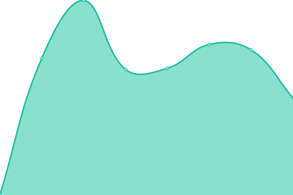
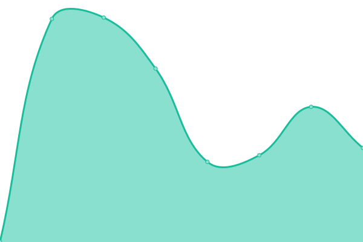
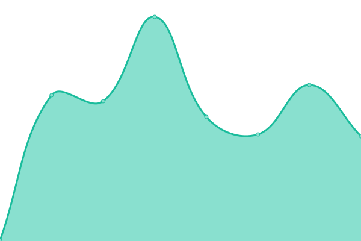
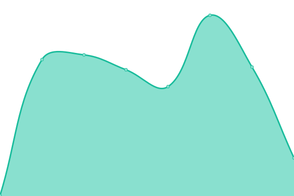

# [📈 Live Status](https://demo.upptime.js.org): <!--live status--> **🟧 Partial outage**

This repository contains the open-source uptime monitor and status page for [NekoZ](https://nekoz.top), powered by [Upptime](https://github.com/upptime/upptime).

With [Upptime](https://upptime.js.org), you can get your own unlimited and free uptime monitor and status page, powered entirely by a GitHub repository. We use [Issues](https://github.com/wlky-0106/upptime/issues) as incident reports, [Actions](https://github.com/wlky-0106/upptime/actions) as uptime monitors, and [Pages](https://demo.upptime.js.org) for the status page.

<!--start: status pages-->
<!-- This summary is generated by Upptime (https://github.com/upptime/upptime) -->
<!-- Do not edit this manually, your changes will be overwritten -->
<!-- prettier-ignore -->
| URL | Status | History | Response Time | Uptime |
| --- | ------ | ------- | ------------- | ------ |
|  [Nekoz Studio](https://home.nekoz.top) | 正常 | [nekoz-studio.yml](https://github.com/wlky-0106/upptime/commits/HEAD/history/nekoz-studio.yml) | 

 306ms
     
 | 

<a href="https://upptime.nekoz.top/history/nekoz-studio">100.00%</a>
    

|  [Nekoz主页](https://nekoz.top) | 正常 | [nekoz.yml](https://github.com/wlky-0106/upptime/commits/HEAD/history/nekoz.yml) | 

 374ms
     
 | 

<a href="https://upptime.nekoz.top/history/nekoz">100.00%</a>
    

|  [Twikoo评论](https://twikoo.nekoz.top/) | 正常 | [twikoo.yml](https://github.com/wlky-0106/upptime/commits/HEAD/history/twikoo.yml) | 

 2344ms
     
 | 

<a href="https://upptime.nekoz.top/history/twikoo">100.00%</a>
    

|  [Nekoz Studio Lark](https://nekozstudio.larksuite.com/) | 停机 | [nekoz-studio-lark.yml](https://github.com/wlky-0106/upptime/commits/HEAD/history/nekoz-studio-lark.yml) | 

 1162ms
     
 | 

<a href="https://upptime.nekoz.top/history/nekoz-studio-lark">97.13%</a>
    

|  [开源字体分享｜OFS](https://learner.eu.org) | 正常 | [ofs.yml](https://github.com/wlky-0106/upptime/commits/HEAD/history/ofs.yml) | 

 250ms
     
 | 

<a href="https://upptime.nekoz.top/history/ofs">100.00%</a>
    

|  [Nekoz Upptime](https://upptime.nekoz.top) | 停机 | [nekoz-upptime.yml](https://github.com/wlky-0106/upptime/commits/HEAD/history/nekoz-upptime.yml) | 

 0ms
     
 | 

<a href="https://upptime.nekoz.top/history/nekoz-upptime">0.00%</a>
    

<!--end: status pages-->

[**Visit our status website →**](https://demo.upptime.js.org)

## 📄 License

- Powered by: [Upptime](https://github.com/upptime/upptime)
- Code: [MIT](./LICENSE) © [NekoZ](https://nekoz.top)
- Data in the `./history` directory: [Open Database License](https://opendatacommons.org/licenses/odbl/1-0/)
